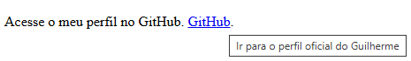
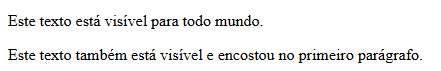

# Estudo de HTML:


##### Sumário
- [Definição](#definição)
- [Tags](#tags)
- [Atributos](#atributos)
- [width](#width)
- [height](#height)
- [title](#title)
- [hidden](#hidden)
- [lang](#lang)

---

##### Definição
_HTML_ é uma linguagem de marcação, e não de programação.

---

##### TAGS

- `<!--` e `-->`: o conteúdo que for colocado entre essas tags será considerados um _comentário_; 
- `<!DOCTYPE html>`: visa garantir a compatibilidade com os navegadores modernos. Com isso está dizendo para o navegador que o código foi escrito em HTML5. É _case insensitive_ funcionando tanto `<!doctype html>` ou `<!DOCTYPE HTML>`, deve vir antes da tag `<html>`;
- `<html>`: deve ser sempre a primeira tag do seu código. Ela deve ser fechada com `</html>`. Ela envolve todo o código;
- `<head>`: define o cabeçalho. O conteúdo dentro das tags `<head>` e `</head>` não é visível no browser, mas contém instruções sobre seu conteúdo e comportamento, como folhas de estilo e scripts;
- `<title>`: define o título título da página, ou seja o texto que aparece na aba/janela do navegador. O conteúdo precisa estar entre `<title>` e `</title>`;
- `<meta>`: define metadados, ou seja, informações sobre o documento HTML. Essas tags são inseridas dentro do elemento `<head>` e servem para especificar o conjunto de caracteres, autoria, configurações de visualização, entre outras informações; 
- `<body>`: representa o conteúdo de um documento HTML, a tag fecha com `</body>`. É permitido apenas um `<body>` por documento.
- `<h1>` até `<h6>`: define do cabeçalho 1 até o cabeçalho 6. Quanto maior o número menor o tamnho da fomnte do cabeçalho. É necessário fechar as tags, por exemplo `<h3>` `</h3>`.
- `<p>`: define um parágrafo. O conteúdo precisa ser fechado pela tag `</p>`.
- `<br>`: cria uma quebra de linha. O _br_ vem de break.
- `<hr>`: é usada para representar uma quebra temática entre parágrafos ou seções de uma página. O _\<hr>_ significa Horizontal Rule (Linha Horizontal). É indicado pensar nela como aquela linha ou espaçamento que encontra-se em livros quando o autor muda de assunto, muda o ponto de vista da história ou passa para um novo tópico dentro do mesmo capítulo. 
Além disso é importante saber que ela é uma tag vazia (ou de fechamento automático), o que significa que ela não tem conteúdo de texto dentro dela e não precisa de uma tag de fechamento.
- `<b>`: transforma o conteúdo em negrito. É preciso fechar com a tag `</b>`.
- `<i>`: transforma o conteúdo em itálico. É preciso fechar com a tag `</i>`.
- `<ol>`: usado para criar uma lista ordenada. É preciso fechar com a tag `</ol>`.
- `<ul>`: usado para criar uma lista não ordenada. É preciso fechar com a tag `</ul>`.
- `<li>`: para inserir elementos tanto listas ordenadas e não ordenadas. É preciso fechar com a tag `</li>`.
- `<footer>`: significa Rodapé. Ela é uma tag semântica, introduzida no HTML5, usada para definir a seção de encerramento de uma página web ou de uma seção específica dentro do site. .É preciso fechar com a tag `</footer>`. Ela fica dentro do _body_.
- `<q>`: significa _quote_(citação) e serve para indicar citações curtas em linha (ou seja, citações que fazem parte do corpo de um parágrafo e não quebram a linha do texto). É preciso fechar com a tag `</q>`. Ela fica dentro do _body_.
Ex:  
```html
<body> 
<p>Meu avô sempre dizia: <q>Quem madruga, Deus ajuda</q>, mas eu prefiro programar à noite.</p> 
</body>
```

Saída: 
Meu avô sempre dizia: “Quem madruga, Deus ajuda”, mas eu prefiro programar à noite.

Obs: Note que o navegador inseriu as aspas estilizadas por conta própria. Se você mudar o idioma da sua página para inglês (<html lang="en">), o navegador mudará automaticamente o estilo das aspas para o padrão americano.

---

##### Atributos

Os atributos são usados para personalizar as tags, modificando sua estrutura ou funcionalidade. Igualmente, os atributos são utilizados para atribuir uma classe ou id a um elemento.

---

##### width

`width="…"`: Define uma largura para o elemento. Ele é usado diretamente dentro de tags HTML que lidam com dimensões visíveis, sendo mais comum em elementos como imagens, vídeos, telas de desenho e tabelas.

Duas formas de definir o width
No HTML, você pode definir a largura usando duas unidades principais:

Em _Pixels_ (px): Define um tamanho fixo. (No HTML5 puro, basta colocar o número, o navegador já entende que são pixels).

Em _Porcentagem_ (%): Define um tamanho relativo. O elemento vai se ajustar à largura da tela ou do bloco onde ele está dentro.

Exemplos Práticos
1. Definindo tamanho fixo em uma imagem (Pixels)
Se você quer que uma imagem tenha exatamente 300 pixels de largura:

```html

```
Obs: Quando define-se apenas o width, o navegador ajusta a altura (height) automaticamente de forma proporcional para a imagem não ficar distorcida (esticada ou achatada).

2. Definindo tamanho responsivo (Porcentagem)
Se você quer que a imagem mude de tamanho de acordo com a tela do usuário (perfeito para celulares), use porcentagem:

```html
<!-- A imagem vai ocupar exatamente a metade da largura da tela do usuário -->

```

---

##### height

`height="…"`: Define a altura vertical de um elemento na tela.

Assim como a largura, ele é aplicado diretamente dentro da tag de abertura de elementos visuais, sendo indispensável para imagens, vídeos e iframes.

Ex:  
```html

```

Obs: Se definir apenas o height="200" (e não colocar o width), o navegador vai calcular a largura automaticamente para que a imagem não fique distorcida. O mesmo acontece se você definir apenas o width.
Se colocar valores fixos para os dois (ex: width="500" height="200"), corre o grande risco de a sua imagem ficar "achatada" ou "esticada".

---

##### title

`title="…"`: Adiciona informações extras (uma dica de tela ou tooltip) a qualquer elemento do HTML.

Ex:  
```html
<p>
  Acesse o meu perfil no GitHub.
  <a href="https://github.com/guilhermelinharesbr" title="Ir para o perfil oficial do Guilherme">GitHub</a>.
</p>
```

Como fica em tela:



É possível notar acima que o atirbuto _title_ foi usado para colocar um título/dica no link de nome GitHub, para quando o usuário passar o mouse sobre o link mostrar a frase "Ir para o perfil oficial do Guilherme".

---

##### hidden

É um atributo global do HTML5. A função dele é esconder completamente um elemento da tela do usuário.

Quando adiciona-se o atributo hidden a qualquer tag HTML, o navegador a renderiza com o equivalente visual a display: none do CSS. Isso significa que o elemento não apenas fica invisível, mas também não ocupa nenhum espaço na página (os outros elementos ao redor se movem para preencher o vazio, como se o elemento escondido nunca tivesse existido ali).

```html
<p>Este texto está visível para todo mundo.</p>

<p hidden>Este texto está escondido e ninguém consegue ver na tela!</p>

<p>Este texto também está visível e encostou no primeiro parágrafo.</p>
```

Como fica em tela:



É possível notar acima que o atirbuto _hidden_ foi usado para esconder o segundo parágrafo.

---

##### lang

O atributo **lang** (que vem de language, ou "idioma" em inglês) é um dos atributos mais importantes do HTML. Ele serve para declarar explicitamente o idioma principal do documento ou de um trecho específico de texto na página.

Embora ele não mude em nada o visual do seu site, ele é considerado uma prática obrigatória para a acessibilidade, SEO e boa renderização da sua página.

Geralmente, o atributo lang é declarado logo no início do documento, diretamente na tag de abertura `<html>`. 

Ex:  
```html
<!DOCTYPE html>
<!-- Aqui você avisa ao navegador: "este site está em português do Brasil" -->
<html lang="pt-BR">
<head>
    <meta charset="UTF-8">
    <title>Minha Página de Estudos</title>
</head>
<body>
    <h1>Olá, Mundo!</h1>
    <p>Estou aprendendo HTML.</p>
</body>
</html>
```

O valor do atributo _lang_ segue um padrão internacional. Ele costuma usar duas letras minúsculas para o idioma e, opcionalmente, duas letras maiúsculas para a região/país:

- **pt-BR**: Português do Brasil
- **pt-PT**: Português de Portugal
- **en**: Inglês (geral)
- **en-US**: Inglês dos Estados Unidos
- **es**: Espanhol

Existem pelo menos 4 motivos porque o atritubo lang é importante:

1. **Acessibilidade** (Leitores de Tela)
Pessoas com deficiência visual utilizam softwares de leitura de tela para navegar na internet. Se você não definir a tag lang, o leitor de tela pode tentar ler o seu texto em português usando a pronúncia e o sotaque do inglês (ou do idioma padrão do computador do usuário). O resultado fica incompreensível. Com lang="pt-BR", o leitor usa a voz e a fonética brasileira corretas.  

2. **Tradução Automática**
Ao entrar em um site estrangeiro, o Google Chrome abre um balãozinho perguntando: "Deseja traduzir esta página?"? O navegador só sabe fazer isso de forma rápida e precisa porque ele lê o atributo lang daquele site (que pode estar como lang="ja" para japonês, por exemplo).  

3. **Corretores Ortográficos e Motores de Busca (SEO)**
Mecanismos de busca como o Google usam o lang para entender o público-alvo da sua página e exibi-la nos resultados de pesquisa das regiões corretas. Além disso, se o usuário tiver campos de texto no seu site, o corretor ortográfico do navegador usará o idioma definido no lang para sugerir correções.

4. **Tipografia e Hifenização**
Alguns navegadores aplicam regras de hifenização automática de palavras ou até usam aspas diferentes (como vimos na tag `<q>`) dependendo do idioma declarado.

Ex2:  
Se o site é em português, mas em algum momento é preciso citar uma frase inteira em outro idioma, pode-se aplicar o lang em tags menores, como `<p>`, `<span>` ou `<q>`:

```html
<html lang="pt-BR">
<body>
    <p>O conceito de design focado no usuário é muito resumido pelo termo em inglês: 
       <!-- Aplicando o lang apenas para essa expressão -->
       <span lang="en">"user-centered design"</span>.
    </p>
</body>
</html>
```

---
